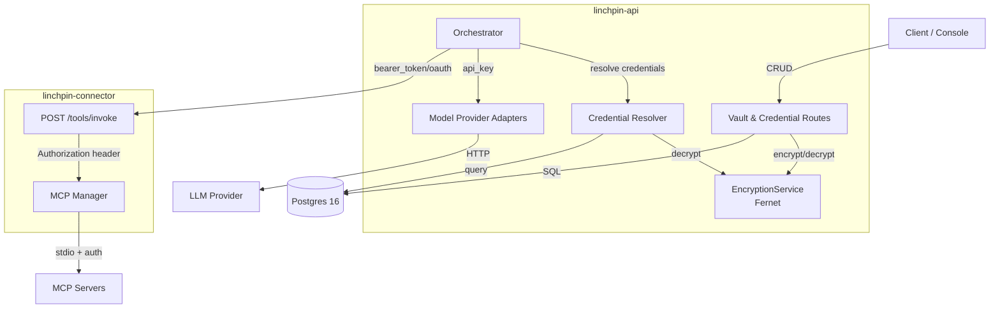
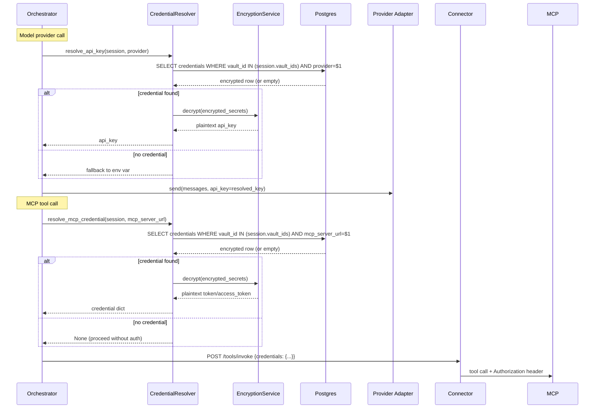

# Design Document: Credential Vaults

## Overview

Credential Vaults adds secure, per-user credential management to Linchpin. Vaults are named collections of encrypted credentials that sessions reference at creation time. At runtime, the orchestrator resolves model provider API keys and MCP server tokens from the session's vaults, eliminating the need for global environment variables and enabling multi-tenant credential isolation.

The feature touches four layers:
- **linchpin-api**: New `EncryptionService`, vault/credential CRUD routes, Alembic migration, orchestrator credential resolution
- **linchpin-connector**: Accepts MCP credentials in `/tools/invoke` requests and injects them as Authorization headers
- **Postgres**: Two new tables (`vaults`, `credentials`) plus a `vault_ids` column on `sessions`
- **linchpin-console**: Vault management UI and session vault selection

Design principles:
- **Write-only secrets**: Secret values are accepted on create/update but never returned in API responses
- **Fernet encryption at rest**: All secret fields are encrypted before persistence using a server-side key
- **Vault-ordered resolution**: When multiple vaults are bound to a session, credentials are resolved in `vault_ids` list order (first match wins)
- **Graceful fallback**: If no vault credential matches, the orchestrator falls back to environment variables (ANTHROPIC_API_KEY, OPENAI_API_KEY)

## Architecture



### Credential Resolution Flow



## Components and Interfaces

### New Components

| Component | Location | Responsibility |
|---|---|---|
| **EncryptionService** | `linchpin-api/app/encryption.py` | Fernet encrypt/decrypt using `VAULT_ENCRYPTION_KEY` env var. Validates key on import. |
| **Vault Routes** | `linchpin-api/app/routes/vaults.py` | CRUD endpoints for vaults and credentials under `/v1/vaults/...` |
| **Credential Resolver** | `linchpin-api/app/credentials.py` | Queries vaults for matching credentials, decrypts secrets, returns plaintext for runtime use |
| **Vault/Credential Models** | `linchpin-api/app/models.py` (additions) | Pydantic request/response models for vaults and credentials |
| **Alembic Migration** | `linchpin-api/alembic/versions/0002_vaults_credentials.py` | DDL for `vaults`, `credentials` tables and `sessions.vault_ids` column |

### Modified Components

| Component | Change |
|---|---|
| **Orchestrator** (`orchestrator.py`) | Before calling `provider.send()`, resolve API key from vaults via `CredentialResolver`. Before MCP tool dispatch, resolve MCP credentials and pass to connector. |
| **Provider Adapters** (`providers.py`) | `send()` accepts optional `api_key` override parameter. When provided, use it instead of the SDK's default env-var-based auth. |
| **Connector** (`linchpin-connector/app/main.py`) | `ToolInvokeRequest.credentials` now carries `auth_type` + `token`/`access_token`. Connector injects as Authorization header on MCP HTTP calls. |
| **Session Models** (`models.py`) | `Session`, `SessionResponse`, `CreateSessionRequest` gain `vault_ids: list[str]` field. |
| **Session Routes** (`routes/sessions.py`) | Validate `vault_ids` on session creation (exist, not archived). |
| **docker-compose.yml** | Add `VAULT_ENCRYPTION_KEY` env var to linchpin-api service. |

### Key Interfaces

```python
# EncryptionService
class EncryptionService:
    def __init__(self, key: str):
        """Initialize with a Fernet-compatible key (base64-encoded 32 bytes)."""
        self._fernet = Fernet(key.encode())

    def encrypt(self, plaintext: str) -> bytes:
        """Encrypt a plaintext string, return ciphertext bytes."""
        return self._fernet.encrypt(plaintext.encode())

    def decrypt(self, ciphertext: bytes) -> str:
        """Decrypt ciphertext bytes, return plaintext string."""
        return self._fernet.decrypt(ciphertext).decode()


# Credential Resolver
class CredentialResolver:
    def __init__(self, encryption: EncryptionService): ...

    async def resolve_api_key(
        self, vault_ids: list[str], provider: str
    ) -> str | None:
        """Search vaults in order for an api_key credential matching provider.
        Returns decrypted API key or None."""

    async def resolve_mcp_credential(
        self, vault_ids: list[str], mcp_server_url: str
    ) -> dict | None:
        """Search vaults in order for a bearer_token or oauth credential
        matching the MCP server URL. Returns dict with auth_type + token fields, or None."""
```

### API Endpoints (New)

| Method | Path | Description |
|---|---|---|
| POST | `/v1/vaults` | Create vault |
| GET | `/v1/vaults` | List vaults (paginated) |
| GET | `/v1/vaults/{vault_id}` | Get vault |
| DELETE | `/v1/vaults/{vault_id}` | Delete vault + all credentials |
| POST | `/v1/vaults/{vault_id}/archive` | Archive vault |
| POST | `/v1/vaults/{vault_id}/credentials` | Create credential |
| GET | `/v1/vaults/{vault_id}/credentials` | List credentials (paginated) |
| GET | `/v1/vaults/{vault_id}/credentials/{credential_id}` | Get credential |
| PATCH | `/v1/vaults/{vault_id}/credentials/{credential_id}` | Update credential secrets |
| DELETE | `/v1/vaults/{vault_id}/credentials/{credential_id}` | Delete credential |
| POST | `/v1/vaults/{vault_id}/credentials/{credential_id}/archive` | Archive credential |

All endpoints require bearer token auth (existing `verify_bearer_token` dependency).

## Data Models

### Vault

```python
class Vault(BaseModel):
    id: str                          # UUID
    display_name: str
    metadata: dict[str, Any] = {}
    created_at: datetime
    updated_at: datetime
    archived_at: datetime | None = None
```

### Credential

```python
CredentialType = Literal["bearer_token", "api_key", "oauth"]
ProviderName = Literal["anthropic", "openai", "ollama"]

class Credential(BaseModel):
    id: str                          # UUID
    vault_id: str                    # FK to vaults
    credential_type: CredentialType
    mcp_server_url: str | None = None   # For bearer_token and oauth
    provider: ProviderName | None = None # For api_key
    client_id: str | None = None        # For oauth (non-secret)
    created_at: datetime
    updated_at: datetime
    archived_at: datetime | None = None
    # encrypted_secrets stored in DB as BYTEA, never exposed in responses
```

### Secret Field Schemas (write-only, per credential_type)

```python
class BearerTokenSecrets(BaseModel):
    token: str

class ApiKeySecrets(BaseModel):
    api_key: str

class OAuthSecrets(BaseModel):
    access_token: str
    refresh_token: str | None = None
    client_secret: str | None = None
```

### Request Models

```python
class CreateVaultRequest(BaseModel):
    display_name: str
    metadata: dict[str, Any] = {}

class CreateBearerTokenCredentialRequest(BaseModel):
    credential_type: Literal["bearer_token"]
    mcp_server_url: str
    token: str

class CreateApiKeyCredentialRequest(BaseModel):
    credential_type: Literal["api_key"]
    provider: ProviderName
    api_key: str

class CreateOAuthCredentialRequest(BaseModel):
    credential_type: Literal["oauth"]
    mcp_server_url: str
    access_token: str
    refresh_token: str | None = None
    client_id: str | None = None
    client_secret: str | None = None

# Discriminated union
CreateCredentialRequest = Annotated[
    CreateBearerTokenCredentialRequest | CreateApiKeyCredentialRequest | CreateOAuthCredentialRequest,
    Discriminator("credential_type"),
]

class UpdateCredentialRequest(BaseModel):
    """PATCH body — only secret fields, all optional."""
    token: str | None = None
    api_key: str | None = None
    access_token: str | None = None
    refresh_token: str | None = None
    client_secret: str | None = None
```

### Response Models

```python
class VaultResponse(BaseModel):
    id: str
    display_name: str
    metadata: dict[str, Any] = {}
    created_at: datetime
    updated_at: datetime
    archived_at: datetime | None = None

class CredentialResponse(BaseModel):
    """All secret fields omitted."""
    id: str
    vault_id: str
    credential_type: CredentialType
    mcp_server_url: str | None = None
    provider: ProviderName | None = None
    client_id: str | None = None
    created_at: datetime
    updated_at: datetime
    archived_at: datetime | None = None
```

### Updated Session Model

```python
class CreateSessionRequest(BaseModel):
    agent_id: str
    environment_id: str
    title: str | None = None
    metadata: dict[str, Any] = {}
    ttl_seconds: int | None = None
    vault_ids: list[str] = []          # NEW

class SessionResponse(BaseModel):
    # ... existing fields ...
    vault_ids: list[str] = []          # NEW
```

### Database Schema Changes

```sql
-- New table: vaults
CREATE TABLE vaults (
    id           UUID PRIMARY KEY DEFAULT gen_random_uuid(),
    display_name TEXT NOT NULL,
    metadata     JSONB NOT NULL DEFAULT '{}',
    created_at   TIMESTAMPTZ NOT NULL DEFAULT now(),
    updated_at   TIMESTAMPTZ NOT NULL DEFAULT now(),
    archived_at  TIMESTAMPTZ
);

-- New table: credentials
CREATE TABLE credentials (
    id                UUID PRIMARY KEY DEFAULT gen_random_uuid(),
    vault_id          UUID NOT NULL REFERENCES vaults(id) ON DELETE CASCADE,
    credential_type   TEXT NOT NULL,
    mcp_server_url    TEXT,
    provider          TEXT,
    encrypted_secrets BYTEA,
    client_id         TEXT,
    created_at        TIMESTAMPTZ NOT NULL DEFAULT now(),
    updated_at        TIMESTAMPTZ NOT NULL DEFAULT now(),
    archived_at       TIMESTAMPTZ
);

-- One active credential per MCP server URL per vault
CREATE UNIQUE INDEX uq_credentials_vault_mcp_url
    ON credentials (vault_id, mcp_server_url)
    WHERE mcp_server_url IS NOT NULL AND archived_at IS NULL;

-- One active credential per provider per vault
CREATE UNIQUE INDEX uq_credentials_vault_provider
    ON credentials (vault_id, provider)
    WHERE provider IS NOT NULL AND archived_at IS NULL;

-- Add vault_ids to sessions
ALTER TABLE sessions ADD COLUMN vault_ids JSONB NOT NULL DEFAULT '[]';
```


## Correctness Properties

*A property is a characteristic or behavior that should hold true across all valid executions of a system — essentially, a formal statement about what the system should do. Properties serve as the bridge between human-readable specifications and machine-verifiable correctness guarantees.*

### Property 1: Vault round-trip

*For any* valid vault creation payload (display_name, metadata), creating a vault and then retrieving it by id should return a Vault resource with display_name and metadata matching the original input, plus server-assigned fields (id, created_at, updated_at).

**Validates: Requirements 1.1, 1.2**

### Property 2: Vault delete cascades to credentials

*For any* vault containing one or more credentials, deleting the vault should remove both the vault and all associated credential records from the database. After deletion, retrieving the vault or any of its credentials should return 404.

**Validates: Requirements 1.5**

### Property 3: Vault archive sets timestamps and purges secrets

*For any* non-archived vault with one or more credentials containing encrypted secrets, archiving the vault should set archived_at on the vault and all associated credentials, AND set encrypted_secrets to NULL on all associated credential records.

**Validates: Requirements 2.1, 2.2**

### Property 4: Credential round-trip with secret redaction

*For any* valid credential creation payload (bearer_token, api_key, or oauth type), creating a credential and then retrieving it should return a Credential resource with all non-secret fields (id, vault_id, credential_type, mcp_server_url, provider, client_id, created_at, updated_at) matching the original input, and all secret fields (token, api_key, access_token, refresh_token, client_secret) absent from the response.

**Validates: Requirements 3.1, 3.2, 3.3, 4.1, 4.4**

### Property 5: Duplicate credential rejection

*For any* vault, creating two active credentials with the same mcp_server_url (for bearer_token/oauth types) or the same provider (for api_key type) should succeed on the first creation and return HTTP 409 on the second.

**Validates: Requirements 3.4, 3.5, 12.3, 12.4**

### Property 6: Encryption round-trip and ciphertext opacity

*For any* valid plaintext secret string, encrypting with the EncryptionService and then decrypting should produce the original plaintext. Additionally, the ciphertext bytes should not contain the plaintext as a substring.

**Validates: Requirements 8.1, 8.5, 3.6**

### Property 7: Write-only secret invariant

*For any* credential of any type, every API response (POST creation response, PATCH update response, GET single, GET list) should contain zero secret field keys (token, api_key, access_token, refresh_token, client_secret) in the response body.

**Validates: Requirements 7.1, 7.2, 7.3**

### Property 8: Credential archive purges secrets

*For any* non-archived credential with encrypted secrets, archiving the credential should set archived_at to a non-null timestamp and set encrypted_secrets to NULL in the database, while retaining all non-secret metadata fields.

**Validates: Requirements 6.2**

### Property 9: Session vault binding validation

*For any* list of vault_ids provided during session creation, the system should accept the request if and only if every vault_id references an existing, non-archived vault. If any vault_id is invalid or references an archived vault, the system should return HTTP 422.

**Validates: Requirements 9.1, 9.2, 9.3, 9.4**

### Property 10: API key resolution with vault ordering and fallback

*For any* session with vault_ids and a model provider name, the credential resolver should return the decrypted api_key from the first vault (in vault_ids order) that contains an active api_key credential for that provider. If no vault contains a matching credential, the resolver should return None (triggering env var fallback).

**Validates: Requirements 10.1, 10.2, 10.3, 10.4**

### Property 11: MCP credential resolution

*For any* session with vault_ids and an MCP server URL, the credential resolver should return the decrypted token (bearer_token) or access_token (oauth) from the first vault (in vault_ids order) that contains an active credential matching that URL. If no vault contains a matching credential, the resolver should return None (proceed without auth).

**Validates: Requirements 11.1, 11.2, 11.3, 11.5**

## Error Handling

### HTTP Error Responses (Vault/Credential Endpoints)

| Status | Condition | Response Body |
|---|---|---|
| 201 | Vault or credential created successfully | Full resource (secrets redacted for credentials) |
| 204 | Vault or credential deleted successfully | No body |
| 400 | Malformed request body | `{"error": "bad_request", "message": "..."}` |
| 401 | Missing or invalid bearer token | `{"error": "unauthorized", "message": "..."}` |
| 404 | Vault or credential not found | `{"error": "not_found", "message": "..."}` |
| 409 | Conflict: duplicate credential, already archived, vault archived, credential limit exceeded | `{"error": "conflict", "message": "..."}` |
| 422 | Validation failure: invalid fields, invalid vault_ids on session creation | `{"error": "validation_error", "message": "...", "details": [...]}` |

### Encryption Errors

- **Missing VAULT_ENCRYPTION_KEY**: linchpin-api refuses to start, logs `"VAULT_ENCRYPTION_KEY environment variable is required"`.
- **Invalid Fernet key format**: linchpin-api refuses to start, logs `"VAULT_ENCRYPTION_KEY is not a valid Fernet key"`.
- **Decryption failure** (corrupted ciphertext or key rotation): `CredentialResolver` catches `InvalidToken`, logs the error, and returns None (triggering fallback behavior). The orchestrator emits `session.error` if no fallback is available.

### Orchestrator Credential Errors

- **No API key found (vaults + env var)**: Emit `session.error` event with message `"No API key found for provider '{provider}'. Configure a vault credential or set the {PROVIDER}_API_KEY environment variable."`, transition session to `failed`.
- **No MCP credential found**: Proceed without authentication (MCP server may not require it). If the MCP server rejects the unauthenticated request, the connector returns an error which is emitted as `agent.mcp_tool_result` with error payload.

## Testing Strategy

### Unit Tests

Unit tests cover specific examples, edge cases, and error conditions using pytest.

Focus areas:
- **EncryptionService**: Specific encrypt/decrypt calls, invalid key handling, empty string edge case
- **Pydantic model validation**: Valid/invalid payloads for all credential types, discriminated union routing
- **Vault CRUD routes**: 201/404/409/422 responses for specific scenarios
- **Credential CRUD routes**: All three credential types, duplicate rejection, archived vault rejection, 20-credential limit
- **Write-only enforcement**: Verify specific responses omit secret fields
- **Session vault binding**: Valid vault_ids, mixed valid/invalid, archived vaults
- **Credential resolver**: Specific resolution scenarios (single vault, multiple vaults, no match, fallback)
- **Alembic migration**: Verify tables and constraints exist after migration

### Property-Based Tests

Property-based tests verify universal properties across generated inputs using [Hypothesis](https://hypothesis.readthedocs.io/) (Python PBT library).

Configuration:
- Minimum 100 iterations per property test (`@settings(max_examples=100)`)
- Each test tagged with a comment referencing the design property
- Tag format: `# Feature: credential-vaults, Property {number}: {title}`

Properties to implement:
1. **Vault round-trip** — Generate random display_name + metadata, create + retrieve, verify equivalence
2. **Vault delete cascades** — Generate random vaults with 0-5 credentials, delete vault, verify all gone
3. **Vault archive purges secrets** — Generate random vaults with credentials, archive, verify timestamps + NULL secrets
4. **Credential round-trip with redaction** — Generate random credentials of all three types, create + retrieve, verify non-secret fields match and secret fields absent
5. **Duplicate credential rejection** — Generate random vault + target (URL or provider), create twice, verify 409 on second
6. **Encryption round-trip and opacity** — Generate random strings (including unicode, empty, long), encrypt + decrypt, verify equality and ciphertext opacity
7. **Write-only secret invariant** — Generate random credentials, hit all response-producing endpoints, verify zero secret keys in every response
8. **Credential archive purges secrets** — Generate random credentials, archive, verify archived_at set and encrypted_secrets NULL
9. **Session vault binding validation** — Generate random vault_ids lists (valid, invalid, archived mix), verify correct accept/reject
10. **API key resolution with ordering** — Generate random multi-vault configurations, verify first-match ordering and fallback
11. **MCP credential resolution** — Generate random vault configurations with MCP credentials, verify correct resolution and None fallback

### Integration Tests

Integration tests verify cross-component behavior with real Postgres:

- **Full vault lifecycle**: Create vault → add credentials → archive vault → verify secrets purged → verify credentials inaccessible for resolution
- **Session with vaults**: Create vaults + credentials → create session with vault_ids → verify orchestrator resolves correct API key
- **MCP credential flow**: Create vault with bearer_token → create session → trigger MCP tool call → verify connector receives credentials
- **Key rotation**: Create credential → update secret via PATCH → verify new secret is used for resolution
- **Migration**: Apply 0002 migration on top of 0001, verify schema correctness

### Smoke Tests

- `VAULT_ENCRYPTION_KEY` is configured in docker-compose.yml
- linchpin-api starts successfully with valid encryption key
- linchpin-api refuses to start without `VAULT_ENCRYPTION_KEY`
- Alembic migration 0002 applies cleanly on top of 0001
- Vault and credential tables exist with correct columns and constraints
