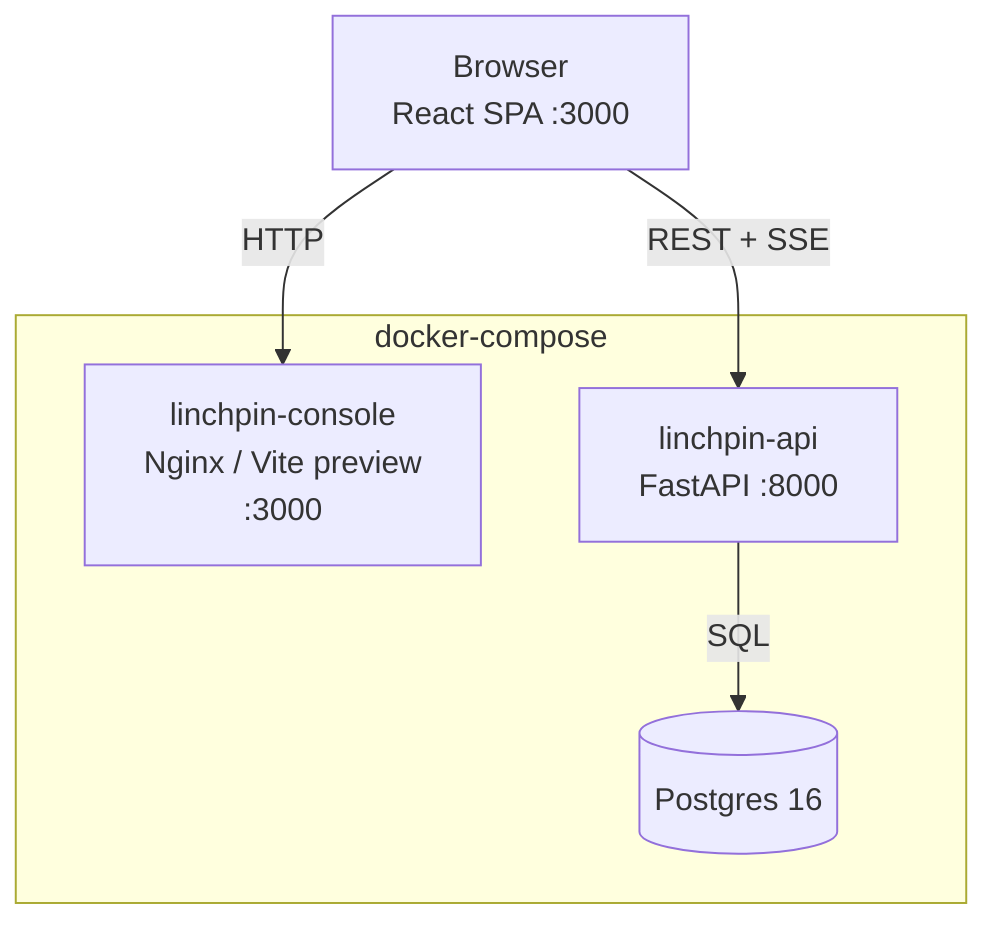
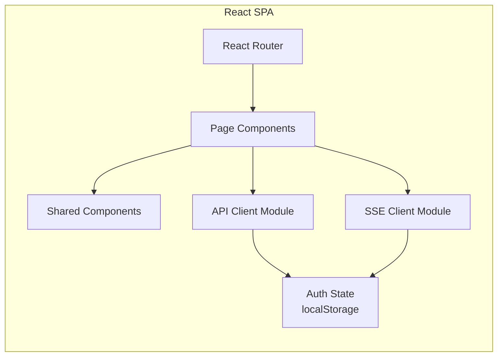

# Design Document: Linchpin Console

## Overview

Linchpin Console is a React + TypeScript single-page application that provides a visual management interface for the Linchpin managed-agent runtime. It communicates with the existing linchpin-api (port 8000) over HTTP and SSE, and is deployed as a new `linchpin-console` service in docker-compose on port 3000.

The console covers five functional areas:
1. Agent management (list, detail, create)
2. Environment management (list, detail, create)
3. Session management (list, detail, create, terminate, archive)
4. Real-time event streaming and message sending
5. Tool confirmation handling for `always_ask` permission policies

The frontend is built with Vite, uses React Router for client-side routing, and relies on a thin API client module that injects the Bearer token from localStorage. SSE connections are managed by a dedicated SSE client module with automatic reconnection using cursor-based replay.

## Architecture



The console is a static SPA served by a lightweight HTTP server (nginx or `vite preview`). All API communication happens directly from the browser to linchpin-api — the console service itself is just a file server. CORS middleware on linchpin-api allows the console origin.

### Client-Side Architecture



### Routing Structure

| Path | Component | Description |
|---|---|---|
| `/` | Redirect | Redirects to `/agents` |
| `/agents` | AgentListView | Agent table with search and pagination |
| `/agents/new` | AgentCreateForm | Agent creation form |
| `/agents/:id` | AgentDetailView | Agent detail page |
| `/environments` | EnvironmentListView | Environment table with pagination |
| `/environments/new` | EnvironmentCreateForm | Environment creation form |
| `/environments/:id` | EnvironmentDetailView | Environment detail page |
| `/sessions` | SessionListView | Session table with filters and pagination |
| `/sessions/:id` | SessionDetailView | Session detail with event stream |

### CORS Configuration

The linchpin-api FastAPI app adds `CORSMiddleware` configured via the `CORS_ALLOWED_ORIGINS` environment variable (default: `http://localhost:3000`). The middleware allows:
- Origins from the env var (comma-separated)
- `Authorization` header
- All standard methods (GET, POST, DELETE, OPTIONS)
- Credentials

## Components and Interfaces

### Layout Components

| Component | Responsibility |
|---|---|
| **AppLayout** | Root layout with Sidebar + main content area |
| **Sidebar** | Persistent left nav: logo, nav links (Agents, Sessions, Environments), active indicator, health status, API key clear action |
| **StatusBadge** | Colored label for session status: running (green), idle (blue), rescheduling (yellow), terminated (gray), failed (red) |
| **LoadingSpinner** | Full-page or inline loading indicator |
| **ErrorMessage** | Displays API error with status code and detail, optional retry button |
| **ConfirmDialog** | Modal confirmation for destructive actions (terminate session) |
| **Pagination** | "Load more" or next/prev controls using offset-based pagination |

### Agent Components

| Component | Responsibility |
|---|---|
| **AgentListView** | Fetches `GET /v1/agents`, renders table (ID, Name, Model, Created), search by ID, pagination, "New agent" button |
| **AgentDetailView** | Fetches `GET /v1/agents/{id}`, displays full config: name, ID, version, model, system prompt, tools, MCP servers, created_at |
| **AgentCreateForm** | Form for `POST /v1/agents`: name, model (provider select, model id, conditional base_url), system prompt, dynamic tool entries, dynamic MCP server entries |

### Environment Components

| Component | Responsibility |
|---|---|
| **EnvironmentListView** | Fetches `GET /v1/environments`, renders table (ID, Name, Networking, Created), pagination, "New environment" button |
| **EnvironmentDetailView** | Fetches `GET /v1/environments/{id}`, displays full config |
| **EnvironmentCreateForm** | Form for `POST /v1/environments`: name, networking type select |

### Session Components

| Component | Responsibility |
|---|---|
| **SessionListView** | Fetches `GET /v1/sessions`, renders table (ID, Title, Status badge, Agent, Created), search by ID, agent_id dropdown filter, archived toggle, pagination, "New session" button |
| **SessionDetailView** | Fetches `GET /v1/sessions/{id}`, displays metadata + stats + usage, contains EventStreamPanel, message input, terminate/archive buttons |
| **SessionCreateDialog** | Modal/dialog for `POST /v1/sessions`: agent dropdown, environment dropdown, optional title, optional TTL |
| **EventStreamPanel** | Renders event list, connects SSE for live events, merges history + live, auto-scroll, visual event type distinction |
| **ToolConfirmationCard** | Renders pending tool call details with Approve/Reject buttons when `session.requires_action` is received |
| **MessageInput** | Text input + send button for `POST /v1/sessions/{id}/events` with `user.message` type, disabled when session is terminal |

### API Client Module

A single `apiClient` module wrapping `fetch`:

```typescript
interface ApiClient {
  get<T>(path: string, params?: Record<string, string>): Promise<T>;
  post<T>(path: string, body: unknown): Promise<T>;
  delete<T>(path: string): Promise<T>;
}
```

Behavior:
- Reads `VITE_API_URL` for base URL (default `http://localhost:8000`)
- Reads API key from localStorage, injects as `Authorization: Bearer <key>`
- On 401 response: clears stored key, redirects to API key input screen
- On error: throws structured error with `status`, `error`, `message`, `details` fields
- Sets `Content-Type: application/json` for POST requests

### SSE Client Module

```typescript
interface SSEClient {
  connect(sessionId: string, cursor?: string, onEvent: (event: SSEEvent) => void): void;
  disconnect(): void;
}
```

Behavior:
- Opens `EventSource` to `GET /v1/sessions/{id}/stream?cursor={cursor}`
- Includes auth via URL query param or custom header (EventSource limitation — may need `fetch`-based SSE or a polyfill like `@microsoft/fetch-event-source`)
- Tracks last received cursor for reconnection
- On connection loss: auto-reconnects with last cursor
- On navigate away: closes connection via cleanup

Since the native `EventSource` API does not support custom headers, the SSE client uses `@microsoft/fetch-event-source` (or equivalent) which supports `Authorization` headers.

## Data Models

### TypeScript Types (mirroring API models)

```typescript
// Model configuration
interface ModelConfig {
  provider: "anthropic" | "openai" | "ollama";
  id: string;
  base_url?: string;
}

// Tool configurations
interface BuiltinToolItemConfig {
  name: string;
  permission_policy: "always_allow" | "always_ask";
  enabled: boolean;
}

interface BuiltinToolConfig {
  type: "builtin";
  default_config: Record<string, unknown>;
  configs: BuiltinToolItemConfig[];
}

interface CustomToolConfig {
  type: "custom";
  name: string;
  description: string;
  input_schema: Record<string, unknown>;
  permission_policy: "always_allow" | "always_ask";
  endpoint?: string;
}

type ToolConfig = BuiltinToolConfig | CustomToolConfig;

interface MCPServerConfig {
  name: string;
  command: string;
  args: string[];
  env: Record<string, string>;
}

// Agent
interface Agent {
  id: string;
  name: string;
  version: number;
  model: ModelConfig;
  system: string;
  tools: ToolConfig[];
  mcp_servers: MCPServerConfig[];
  created_at: string;
}

// Environment
interface NetworkingConfig {
  type: "none" | "unrestricted";
}

interface EnvironmentConfig {
  networking: NetworkingConfig;
}

interface Environment {
  id: string;
  name: string;
  config: EnvironmentConfig;
  created_at: string;
}

// Session
type SessionStatus = "running" | "idle" | "rescheduling" | "terminated" | "failed";

interface SessionStats {
  total_events: number;
  tool_calls: number;
  model_turns: number;
}

interface SessionUsage {
  input_tokens: number;
  output_tokens: number;
}

interface Session {
  id: string;
  agent_id: string;
  agent_version: number;
  environment_id: string;
  status: SessionStatus;
  container_id?: string;
  title?: string;
  metadata: Record<string, unknown>;
  created_at: string;
  updated_at: string;
  archived_at?: string;
  last_event_cursor?: string;
  ttl_seconds?: number;
  stats: SessionStats;
  usage: SessionUsage;
}

// Event
type EventType =
  | "user.message" | "user.interrupt" | "user.tool_confirmation" | "user.custom_tool_result"
  | "agent.message" | "agent.thinking" | "agent.tool_use" | "agent.tool_result"
  | "agent.mcp_tool_use" | "agent.mcp_tool_result" | "agent.custom_tool_use"
  | "session.status_running" | "session.status_idle" | "session.status_rescheduled"
  | "session.status_terminated" | "session.error" | "session.requires_action";

interface SessionEvent {
  session_id: string;
  cursor: string;
  seq: number;
  type: EventType;
  payload: Record<string, unknown>;
  processed_at?: string;
}

// Paginated response
interface PaginatedResponse<T> {
  data: T[];
  next_cursor?: string;
  has_more: boolean;
}

// Paginated events response
interface PaginatedEventsResponse {
  events: SessionEvent[];
  next_cursor?: string;
}
```

### API Request Types

```typescript
interface CreateAgentRequest {
  name: string;
  model: ModelConfig;
  system: string;
  tools: ToolConfig[];
  mcp_servers: MCPServerConfig[];
}

interface CreateEnvironmentRequest {
  name: string;
  config: EnvironmentConfig;
}

interface CreateSessionRequest {
  agent_id: string;
  environment_id: string;
  title?: string;
  ttl_seconds?: number;
}

interface PostEventsRequest {
  events: Array<{
    type: EventType;
    payload: Record<string, unknown>;
  }>;
}
```


## Correctness Properties

*A property is a characteristic or behavior that should hold true across all valid executions of a system — essentially, a formal statement about what the system should do. Properties serve as the bridge between human-readable specifications and machine-verifiable correctness guarantees.*

### Property 1: API client injects Bearer token on every request

*For any* API path and any stored API key string, every request made by the API client module must include an `Authorization: Bearer <key>` header with the exact stored key value.

**Validates: Requirements 2.2**

### Property 2: Sidebar presence and active highlighting across all routes

*For any* valid application route path, the Sidebar component must be rendered, and the navigation link corresponding to the current section (Agents, Sessions, or Environments) must have the active/highlighted style while the other links do not.

**Validates: Requirements 3.1, 3.3**

### Property 3: Agent list row renders all required columns

*For any* valid Agent object, the rendered table row in AgentListView must contain the agent's ID, name, model (provider and model id), and a formatted created_at timestamp.

**Validates: Requirements 4.2**

### Property 4: Client-side ID search filtering

*For any* list of resources (agents or sessions) and any search substring, the filtered results must contain exactly those items whose ID includes the search substring (case-insensitive), and no others.

**Validates: Requirements 4.3, 9.3**

### Property 5: Agent detail view renders all configuration fields

*For any* valid Agent object, the AgentDetailView must render the agent's name, ID, version, model configuration (provider, model id, base_url if present), system prompt, tools list with permissions, MCP server configurations, and created_at timestamp.

**Validates: Requirements 5.2**

### Property 6: Environment list row renders all required columns

*For any* valid Environment object, the rendered table row in EnvironmentListView must contain the environment's ID, name, networking type, and a formatted created_at timestamp.

**Validates: Requirements 7.2**

### Property 7: Session list row renders all required columns

*For any* valid Session object, the rendered table row in SessionListView must contain the session's ID, title (or "Untitled" if null), status as a StatusBadge, agent_id, and a formatted created_at timestamp.

**Validates: Requirements 9.2**

### Property 8: Session detail view renders all metadata fields

*For any* valid Session object, the SessionDetailView must render the session's ID, title, status badge, agent_id, environment_id, created_at, updated_at, container_id, stats (total_events, tool_calls, model_turns), and usage (input_tokens, output_tokens).

**Validates: Requirements 11.2**

### Property 9: Event list merge preserves chronological order without duplicates

*For any* list of historical events and any list of live SSE events (potentially overlapping by cursor), the merge function must produce a single list where all cursors are unique and events are ordered by ascending sequence number.

**Validates: Requirements 12.2, 16.3**

### Property 10: Event type visual classification

*For any* valid EventType string, the event rendering logic must assign a distinct visual category (icon, color, or label) that distinguishes between user messages, agent messages, agent thinking, tool use, tool results, session status changes, and errors.

**Validates: Requirements 12.3**

### Property 11: Terminal session disables message input

*For any* session with status in {terminated, failed}, the message input field and send button must be disabled, and a message indicating the session is no longer active must be displayed.

**Validates: Requirements 13.5**

### Property 12: StatusBadge renders correct style per session status

*For any* valid SessionStatus value, the StatusBadge component must render with the specified color and label: running → green, idle → blue, rescheduling → yellow, terminated → gray, failed → red.

**Validates: Requirements 17.1**

### Property 13: Error message renders status code and detail

*For any* API error response containing an HTTP status code and an error detail string, the ErrorMessage component must render both the numeric status code and the detail text in a user-friendly format.

**Validates: Requirements 17.4**

## Error Handling

### API Client Error Handling

| Scenario | Behavior |
|---|---|
| No API key in localStorage | Show API key input screen, block all API calls |
| HTTP 401 from API | Clear stored API key, redirect to API key input screen |
| HTTP 404 from API | Display "not found" message in the relevant view |
| HTTP 422 from API | Display validation error details inline near form fields |
| HTTP 409 from API | Display conflict message (e.g., "session already archived") |
| HTTP 5xx from API | Display generic error with status code and API error message |
| Network error (fetch fails) | Display "Connection error — check that linchpin-api is running" with a retry button |
| Request timeout | Treat as network error, show retry option |

### SSE Error Handling

| Scenario | Behavior |
|---|---|
| SSE connection lost | Auto-reconnect with last received cursor for seamless replay |
| SSE connection to terminated session | Do not open SSE connection; display static event history only |
| Invalid cursor on reconnect | Fall back to connecting without cursor (full replay) |
| SSE parse error | Log to console, skip malformed event, continue listening |

### Form Error Handling

| Scenario | Behavior |
|---|---|
| Submit while request in flight | Submit button disabled, prevent duplicate submissions |
| Validation error (422) | Display error details inline near relevant fields |
| Server error on submit | Display error message above form, re-enable submit button |
| Required field empty | Client-side validation prevents submission, highlight field |

### General UI Error Handling

- All error messages are user-friendly — no raw stack traces or JSON dumps
- Loading states shown for all async operations (spinners for page loads, inline indicators for form submissions)
- Failed data fetches show error message with retry button
- Stale data after error is preserved (don't clear the screen on refresh failure)

## Testing Strategy

### Unit Tests (Vitest + React Testing Library)

Unit tests cover specific examples, edge cases, and component rendering:

- **API Client**: Verify base URL configuration, Bearer token injection, 401 handling, error response parsing
- **SSE Client**: Verify connection lifecycle, cursor tracking, reconnection behavior (mocked EventSource)
- **Component rendering**: Verify each page component renders correctly with mocked API data
- **Form submissions**: Verify correct request bodies, loading states, error display
- **Navigation**: Verify routing, sidebar active state, back links
- **Auth flow**: Verify API key input, localStorage persistence, clear mechanism
- **Tool confirmation**: Verify approve/reject sends correct payloads
- **Session lifecycle**: Verify terminate/archive button visibility and API calls

### Property-Based Tests (fast-check)

Property-based tests verify universal properties across generated inputs using [fast-check](https://github.com/dubzzz/fast-check) (TypeScript PBT library).

Configuration:
- Minimum 100 iterations per property test (`fc.assert(property, { numRuns: 100 })`)
- Each test tagged with a comment referencing the design property
- Tag format: `// Feature: linchpin-console, Property {number}: {title}`

Properties to implement:
1. **API client Bearer token** — Generate random API keys and paths, verify Authorization header
2. **Sidebar active highlighting** — Generate random route paths, verify correct nav link highlighted
3. **Agent list row rendering** — Generate random Agent objects, verify all columns present in rendered output
4. **Client-side ID search** — Generate random resource lists and search strings, verify correct filtering
5. **Agent detail rendering** — Generate random Agent objects, verify all fields present
6. **Environment list row rendering** — Generate random Environment objects, verify all columns present
7. **Session list row rendering** — Generate random Session objects, verify all columns and StatusBadge
8. **Session detail rendering** — Generate random Session objects, verify all fields present
9. **Event merge** — Generate random historical + live event lists with overlapping cursors, verify unique cursors in ascending order
10. **Event type classification** — Generate random EventType values, verify distinct visual category assigned
11. **Terminal session input disabled** — Generate sessions with terminal statuses, verify input disabled
12. **StatusBadge mapping** — Generate random SessionStatus values, verify correct color and label
13. **Error message rendering** — Generate random status codes and detail strings, verify both rendered

### Integration Tests

Integration tests verify the console works end-to-end with a running linchpin-api:

- **Full CRUD flow**: Create agent → create environment → create session → send message → view events → terminate → archive
- **SSE streaming**: Open session detail → verify live events appear → navigate away → verify disconnect → return → verify reconnect with cursor
- **Auth flow**: Load with no key → enter key → verify API calls work → simulate 401 → verify redirect to key input
- **CORS**: Verify browser can make cross-origin requests from :3000 to :8000

### Smoke Tests

- `docker-compose up` starts linchpin-console on port 3000
- Console loads in browser and shows API key input or sidebar
- CORS preflight requests succeed from console origin
- Health indicator in sidebar reflects API status
