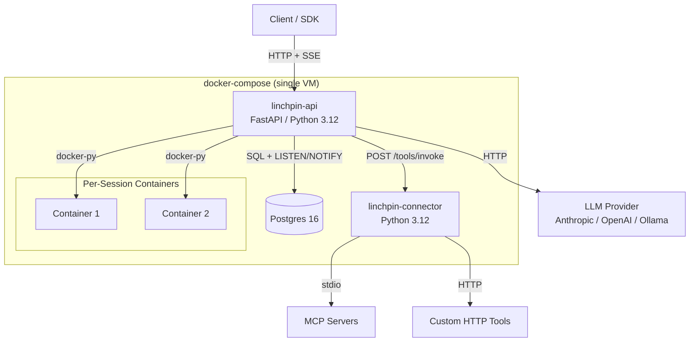
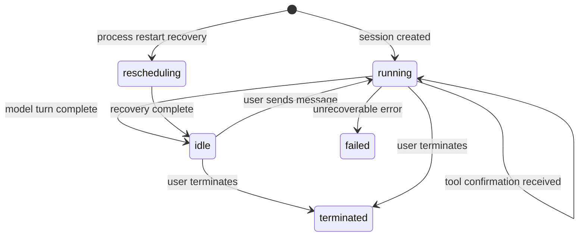

# Design Document: Linchpin MVP

## Overview

Linchpin MVP is a self-hostable runtime for managed AI agents, deployed as two Python processes plus Postgres on a single VM via docker-compose. The system enables developers to create agents, run them inside isolated Docker containers, stream events in real time, and execute tools with configurable permissions — all without vendor lock-in.

The architecture follows a clear separation:
- **linchpin-api** (FastAPI): HTTP surface, orchestrator loop, sandbox management, built-in tools, SSE streaming
- **linchpin-connector** (Python): MCP server management (stdio), custom HTTP tool invocation
- **Postgres 16**: Persistent storage, Alembic migrations, LISTEN/NOTIFY for event fanout

Target size: ~2–3k lines of Python total.

## Architecture



### Process Communication

- **Client ↔ linchpin-api**: HTTP REST + SSE (bearer token auth)
- **linchpin-api ↔ Postgres**: asyncpg for queries, LISTEN/NOTIFY for orchestrator wakeup
- **linchpin-api ↔ linchpin-connector**: Internal HTTP (`POST /tools/invoke`), no auth (internal network only)
- **linchpin-api ↔ Docker**: docker-py SDK, Docker socket mounted into the API container
- **linchpin-api ↔ LLM**: HTTP via provider-specific adapters (Anthropic, OpenAI, Ollama)
- **linchpin-connector ↔ MCP servers**: stdio subprocess transport
- **linchpin-connector ↔ Custom tools**: HTTP to user-configured endpoints

### Session State Machine



States: `rescheduling`, `running`, `idle`, `terminated`, `failed`. Terminal states: `terminated`, `failed`.

### Orchestrator Loop

Each live session gets one async task. The loop:

1. Construct conversation context from event log
2. Send to Model_Provider
3. On text response → emit `agent.message`, transition to `idle`
4. On tool_use → emit `agent.tool_use`, evaluate policy
   - `always_allow` → execute tool → emit `agent.tool_result` → loop back to step 2
   - `always_ask` → emit `session.requires_action` → block on LISTEN/NOTIFY for confirmation
5. On thinking → emit `agent.thinking` → continue
6. On interrupt → stop current turn → transition to `idle`
7. On error → emit `session.error` → transition to `failed`

Recovery: On process restart, query for non-terminal sessions, set status to `rescheduling`, replay event log, transition to `idle`.

## Components and Interfaces

### linchpin-api Components

| Component | Responsibility |
|---|---|
| **HTTP Router** | FastAPI routes for all `/v1/` endpoints, request validation via Pydantic |
| **Auth Middleware** | Bearer token validation against `LINCHPIN_API_KEY` env var |
| **Orchestrator** | One async task per session; drives the agent loop, blocks on PG LISTEN/NOTIFY |
| **Model Provider Adapters** | Anthropic, OpenAI, Ollama adapters with retry (3 attempts, exponential backoff) |
| **Policy Evaluator** | Dict-based permission lookup per tool; returns `always_allow` or `always_ask` |
| **Sandbox (Docker)** | Abstract protocol with Docker implementation: `create`, `exec`, `write_file`, `read_file`, `destroy` |
| **Built-in Tools** | 8 tools: bash, read, write, edit, glob, grep, web_fetch, web_search (stub) |
| **Event Store** | Append-only event log in Postgres, cursor generation, pagination |
| **SSE Streamer** | Server-Sent Events endpoint with cursor-based replay + live streaming |
| **Session Manager** | CRUD, state transitions, TTL enforcement, archival |
| **Startup** | Migration check, Docker network pre-creation, session recovery |

### linchpin-connector Components

| Component | Responsibility |
|---|---|
| **HTTP Server** | Single endpoint: `POST /tools/invoke` |
| **MCP Manager** | Spawns/manages MCP server subprocesses per session (stdio transport) |
| **HTTP Tool Invoker** | Forwards custom tool calls to configured HTTP endpoints |

### Key Interfaces

```python
# Sandbox Protocol
class SandboxProtocol(Protocol):
    async def create(self, image: str, network: str) -> str: ...  # returns container_id
    async def exec(self, container_id: str, command: str) -> ExecResult: ...
    async def write_file(self, container_id: str, path: str, content: str) -> None: ...
    async def read_file(self, container_id: str, path: str) -> str: ...
    async def destroy(self, container_id: str) -> None: ...

# Model Provider Protocol
class ModelProviderProtocol(Protocol):
    async def send(self, messages: list[Message], config: ModelConfig) -> ModelResponse: ...

# Policy Evaluator
class PolicyEvaluator:
    def evaluate(self, agent: Agent, tool_name: str) -> Permission: ...
    # Returns always_allow, always_ask, or denied (tool not in agent's list)

# Connector /tools/invoke request
class ToolInvokeRequest(BaseModel):
    session_id: str
    tool_type: Literal["mcp", "custom_http"]
    server_name: str | None  # for MCP
    tool_name: str
    arguments: dict
    credentials: dict | None  # env vars for MCP
    endpoint: str | None  # for custom HTTP
```

### HTTP API Endpoints

| Method | Path | Description |
|---|---|---|
| POST | `/v1/agents` | Create agent |
| GET | `/v1/agents/{id}` | Get agent |
| GET | `/v1/agents` | List agents (paginated) |
| POST | `/v1/environments` | Create environment |
| GET | `/v1/environments/{id}` | Get environment |
| GET | `/v1/environments` | List environments (paginated) |
| POST | `/v1/sessions` | Create session |
| GET | `/v1/sessions` | List sessions (paginated) |
| GET | `/v1/sessions/{id}` | Get session |
| POST | `/v1/sessions/{id}` | Send event to session |
| DELETE | `/v1/sessions/{id}` | Terminate session |
| POST | `/v1/sessions/{id}/archive` | Archive session |
| POST | `/v1/sessions/{id}/events` | Post event to session |
| GET | `/v1/sessions/{id}/events` | Get events (cursor-paginated) |
| GET | `/v1/sessions/{id}/stream` | SSE stream |


## Data Models

### Agent

```python
class Agent(BaseModel):
    id: str                    # UUID
    name: str
    version: int               # Auto-incremented
    model: ModelConfig
    system: str                # System prompt
    tools: list[ToolConfig]
    mcp_servers: list[MCPServerConfig]
    created_at: datetime

class ModelConfig(BaseModel):
    provider: Literal["anthropic", "openai", "ollama"]
    id: str                    # Model identifier (e.g., "claude-sonnet-4-20250514")
    base_url: str | None       # Only for ollama

class ToolConfig(BaseModel):
    name: str
    permission: Literal["always_allow", "always_ask"]
    # For custom tools:
    type: Literal["built_in", "custom_http"] | None
    endpoint: str | None       # HTTP endpoint for custom tools

class MCPServerConfig(BaseModel):
    name: str
    command: str
    args: list[str]
    env: dict[str, str]        # Credentials as env vars
```

### Environment

```python
class Environment(BaseModel):
    id: str                    # UUID
    name: str
    config: EnvironmentConfig
    created_at: datetime

class EnvironmentConfig(BaseModel):
    networking: NetworkingConfig

class NetworkingConfig(BaseModel):
    type: Literal["none", "unrestricted"]
```

### Session

```python
class Session(BaseModel):
    id: str                    # UUID
    agent_id: str
    agent_version: int
    environment_id: str
    status: Literal["rescheduling", "running", "idle", "terminated", "failed"]
    container_id: str | None
    title: str | None
    metadata: dict
    created_at: datetime
    updated_at: datetime
    archived_at: datetime | None
    last_event_cursor: str | None
    ttl_seconds: int | None
    stats: SessionStats
    usage: SessionUsage

class SessionStats(BaseModel):
    total_events: int
    tool_calls: int
    model_turns: int

class SessionUsage(BaseModel):
    input_tokens: int
    output_tokens: int
```

### Event

```python
class Event(BaseModel):
    session_id: str
    cursor: str                # Opaque string (e.g., base64-encoded seq)
    seq: int                   # Monotonic sequence number per session
    type: str                  # From event taxonomy
    payload: dict              # JSONB
    processed_at: datetime | None
```

### Event Type Taxonomy

```
User events:        user.message, user.interrupt, user.tool_confirmation, user.custom_tool_result
Agent events:       agent.message, agent.thinking, agent.tool_use, agent.tool_result,
                    agent.mcp_tool_use, agent.mcp_tool_result, agent.custom_tool_use
Session events:     session.status_running, session.status_idle, session.status_rescheduled,
                    session.status_terminated, session.error, session.requires_action
```

### Database Schema (Postgres 16)

```sql
CREATE TABLE agents (
    id          UUID PRIMARY KEY DEFAULT gen_random_uuid(),
    name        TEXT NOT NULL,
    version     INTEGER NOT NULL DEFAULT 1,
    model       JSONB NOT NULL,
    system      TEXT NOT NULL,
    tools       JSONB NOT NULL DEFAULT '[]',
    mcp_servers JSONB NOT NULL DEFAULT '[]',
    created_at  TIMESTAMPTZ NOT NULL DEFAULT now()
);

CREATE TABLE environments (
    id          UUID PRIMARY KEY DEFAULT gen_random_uuid(),
    name        TEXT NOT NULL,
    config      JSONB NOT NULL,
    created_at  TIMESTAMPTZ NOT NULL DEFAULT now()
);

CREATE TABLE sessions (
    id                UUID PRIMARY KEY DEFAULT gen_random_uuid(),
    agent_id          UUID NOT NULL REFERENCES agents(id),
    agent_version     INTEGER NOT NULL,
    environment_id    UUID NOT NULL REFERENCES environments(id),
    status            TEXT NOT NULL DEFAULT 'running',
    container_id      TEXT,
    title             TEXT,
    metadata          JSONB NOT NULL DEFAULT '{}',
    created_at        TIMESTAMPTZ NOT NULL DEFAULT now(),
    updated_at        TIMESTAMPTZ NOT NULL DEFAULT now(),
    archived_at       TIMESTAMPTZ,
    last_event_cursor TEXT,
    ttl_seconds       INTEGER,
    stats             JSONB NOT NULL DEFAULT '{"total_events":0,"tool_calls":0,"model_turns":0}',
    usage             JSONB NOT NULL DEFAULT '{"input_tokens":0,"output_tokens":0}'
);

CREATE TABLE events (
    session_id   UUID NOT NULL REFERENCES sessions(id),
    cursor       TEXT NOT NULL,
    seq          INTEGER NOT NULL,
    type         TEXT NOT NULL,
    payload      JSONB NOT NULL DEFAULT '{}',
    processed_at TIMESTAMPTZ,
    PRIMARY KEY (session_id, seq)
);

CREATE INDEX idx_events_cursor ON events (session_id, cursor);
```


## Correctness Properties

*A property is a characteristic or behavior that should hold true across all valid executions of a system — essentially, a formal statement about what the system should do. Properties serve as the bridge between human-readable specifications and machine-verifiable correctness guarantees.*

### Property 1: Agent round-trip

*For any* valid agent creation payload, creating an agent and then retrieving it by id should return an equivalent Agent resource with all fields matching the original input (name, model, system, tools, mcp_servers) plus server-assigned fields (id, version, created_at).

**Validates: Requirements 1.1, 1.6, 2.1**

### Property 2: Agent validation rejects invalid input

*For any* agent creation payload where the model provider is not one of {anthropic, openai, ollama}, or where any tool entry has a permission not in {always_allow, always_ask}, or where required fields are missing, the system should reject the request with a 422 response and the agent should not be persisted.

**Validates: Requirements 1.2, 1.4, 1.5**

### Property 3: Environment round-trip

*For any* valid environment creation payload, creating an environment and then retrieving it by id should return an equivalent Environment resource with all fields matching the original input (name, config) plus server-assigned fields (id, created_at).

**Validates: Requirements 3.1, 3.4, 4.1**

### Property 4: Environment validation rejects invalid input

*For any* environment creation payload where the networking type is not one of {none, unrestricted}, or where required fields are missing, the system should reject the request with a 422 response and the environment should not be persisted.

**Validates: Requirements 3.2, 3.3**

### Property 5: Session state machine transitions

*For any* session, the status must be one of {rescheduling, running, idle, terminated, failed}. *For any* session in idle state, receiving a user.message event must transition the status to running. *For any* session in running state with a pending tool confirmation, the status must remain running. The states terminated and failed are terminal — no further transitions are allowed.

**Validates: Requirements 6.1, 6.4, 6.7**

### Property 6: Event structure invariants

*For any* sequence of events appended to a session, each event must have a unique opaque cursor and a monotonically increasing sequence number. *For any* event serialized to SSE format, the JSON payload must contain the fields: type, cursor, and payload.

**Validates: Requirements 7.3, 7.4**

### Property 7: Cursor-based event filtering

*For any* session event log and any valid cursor within that log, querying events with that cursor (either via SSE replay or the after_cursor REST parameter) must return exactly the events with sequence numbers strictly greater than the cursor's sequence number, in ascending order.

**Validates: Requirements 7.2, 8.2**

### Property 8: Event pagination

*For any* session event log, querying events must return results ordered by sequence number. *For any* limit parameter value, the result set must contain at most that many events. When additional events exist beyond the returned page, the response must include a next_cursor field; when no additional events exist, next_cursor must be absent.

**Validates: Requirements 8.1, 8.3, 8.4**

### Property 9: Event type validation

*For any* string, the event type validator must accept it if and only if it belongs to the set of valid event types: {user.message, user.interrupt, user.tool_confirmation, user.custom_tool_result, agent.message, agent.thinking, agent.tool_use, agent.tool_result, agent.mcp_tool_use, agent.mcp_tool_result, agent.custom_tool_use, session.status_running, session.status_idle, session.status_rescheduled, session.status_terminated, session.error, session.requires_action}. Any string not in this set must be rejected with a 422 response.

**Validates: Requirements 10.1, 10.2, 10.3, 10.4**

### Property 10: Policy evaluation correctness

*For any* agent with a configured set of tools and permissions, the Policy Evaluator must return the exact permission (always_allow or always_ask) configured for each tool. *For any* tool name not present in the agent's tool list, the Policy Evaluator must deny execution.

**Validates: Requirements 15.1, 15.2, 15.3**

### Property 11: Authentication token validation

*For any* API request, the system must accept the request if and only if the Authorization header contains a bearer token matching the configured LINCHPIN_API_KEY. Any request with a missing, malformed, or non-matching token must be rejected with a 401 response.

**Validates: Requirements 18.1, 18.2, 18.3**

### Property 12: Archived session rejects new events

*For any* archived session (one with a non-null archived_at timestamp), attempting to post any new event must be rejected, and the session's event log must remain unchanged.

**Validates: Requirements 19.3**

### Property 13: Event log replay reconstructs context

*For any* session event log, replaying the events in sequence order must reconstruct a conversation context equivalent to the context that existed when the last event was originally processed.

**Validates: Requirements 23.2**

### Property 14: Model provider retry with exponential backoff

*For any* sequence of retryable errors from a model provider, the adapter must retry up to 3 times with exponential backoff. After 3 failed attempts, the adapter must stop retrying and signal failure.

**Validates: Requirements 12.4, 12.5**


## Error Handling

### HTTP Error Responses

| Status | Condition | Response Body |
|---|---|---|
| 401 | Missing or invalid bearer token | `{"error": "unauthorized", "message": "..."}` |
| 404 | Resource not found (agent, environment, session) | `{"error": "not_found", "message": "..."}` |
| 422 | Validation failure (invalid fields, unknown event type) | `{"error": "validation_error", "message": "...", "details": [...]}` |
| 409 | Conflict (e.g., posting event to archived session) | `{"error": "conflict", "message": "..."}` |
| 500 | Internal server error | `{"error": "internal_error", "message": "..."}` |

### Orchestrator Error Handling

- **Model provider errors**: Retry with exponential backoff (3 attempts). On exhaustion, emit `session.error` event and transition session to `failed`.
- **Sandbox errors**: Capture error from Docker operations, emit `session.error` event with descriptive message, transition to `failed`.
- **MCP/Custom tool errors**: Return error response from connector, emit `agent.tool_result` or `agent.mcp_tool_result` with error payload, continue orchestrator loop (let the model decide how to handle).
- **Unrecoverable errors**: Any unexpected exception in the orchestrator loop emits `session.error` and transitions to `failed`.

### Connector Error Handling

- **MCP subprocess crash**: Return error response with subprocess exit code and stderr to linchpin-api.
- **Custom HTTP tool failure**: Return error response with HTTP status code and response body.
- **Timeout**: Both MCP and custom HTTP calls should have configurable timeouts (default 30s). On timeout, return error response.

### Recovery Error Handling

- **Event log replay failure**: Log the error, set session to `failed`, emit `session.error`.
- **Container no longer exists on restart**: Set session to `failed` (container was lost).

### SSE Error Handling

- **Client disconnect**: Clean up the SSE connection and associated LISTEN/NOTIFY subscription.
- **Invalid cursor**: Return 422 if the cursor does not correspond to any event in the session.

## Testing Strategy

### Unit Tests

Unit tests cover specific examples, edge cases, and error conditions using pytest.

Focus areas:
- **Pydantic model validation**: Specific valid/invalid payloads for Agent, Environment, Session, Event models
- **HTTP endpoint responses**: Correct status codes (201, 401, 404, 422) for specific scenarios
- **State machine edge cases**: Terminal state rejection, invalid transitions
- **Policy evaluator**: Specific permission lookups, edge case of empty tool list
- **Cursor encoding/decoding**: Specific cursor values, edge cases (first event, last event)
- **Error response formatting**: Correct error structure for each error type
- **Model provider adapter**: Mock-based tests for each provider's request/response format
- **Built-in tool parameter validation**: Specific valid/invalid tool call parameters

### Property-Based Tests

Property-based tests verify universal properties across generated inputs using [Hypothesis](https://hypothesis.readthedocs.io/) (Python PBT library).

Configuration:
- Minimum 100 iterations per property test (`@settings(max_examples=100)`)
- Each test tagged with a comment referencing the design property
- Tag format: `# Feature: linchpin-mvp, Property {number}: {title}`

Properties to implement:
1. **Agent round-trip** — Generate random valid agent payloads, create + retrieve, verify equivalence
2. **Agent validation** — Generate random invalid payloads, verify rejection
3. **Environment round-trip** — Generate random valid environment payloads, create + retrieve, verify equivalence
4. **Environment validation** — Generate random invalid payloads, verify rejection
5. **Session state machine** — Generate random state + event combinations, verify transition rules
6. **Event structure invariants** — Generate random event sequences, verify cursor uniqueness and seq monotonicity
7. **Cursor-based event filtering** — Generate random event logs + cursors, verify correct subset returned
8. **Event pagination** — Generate random event logs + pagination params, verify ordering, limit, next_cursor
9. **Event type validation** — Generate random strings, verify accept/reject matches the valid set exactly
10. **Policy evaluation** — Generate random agents + tool names, verify correct permission returned
11. **Auth token validation** — Generate random tokens, verify accept iff matches configured key
12. **Archived session rejection** — Generate random events, verify all rejected for archived sessions
13. **Event log replay** — Generate random event logs, verify replay reconstructs correct context
14. **Model provider retry** — Generate random failure sequences, verify retry count and backoff behavior

### Integration Tests

Integration tests verify cross-component behavior with real Postgres and Docker:

- **Session lifecycle**: Create agent → create environment → create session → send message → receive events → terminate
- **SSE streaming**: Open stream → emit events → verify delivery → reconnect with cursor → verify replay
- **Docker sandbox**: Create container → exec command → write/read file → destroy
- **MCP tool execution**: Configure MCP server → start session → invoke MCP tool → verify result
- **Custom HTTP tool**: Configure custom tool → invoke → verify HTTP call and result
- **Process recovery**: Create sessions → simulate restart → verify recovery
- **Docker networking**: Verify linchpin-none isolates, linchpin-open allows external access

### Smoke Tests

- docker-compose.yml defines all three services with correct configuration
- Docker socket is mounted into linchpin-api
- LINCHPIN_API_KEY is configured
- Alembic migrations directory exists and is configured
- Database tables exist after migration
- linchpin-none and linchpin-open Docker networks are created at startup

