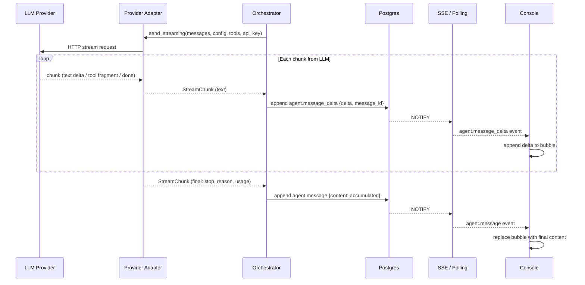

# Design Document: Token Streaming

## Overview

Token streaming adds incremental text delivery to the Linchpin runtime. Today, each model provider adapter calls the upstream LLM with `stream=false`, waits for the complete response, and the orchestrator emits a single `agent.message` event. For local Ollama inference on CPU this means 30–100+ seconds of silence.

This feature introduces:

1. A `send_streaming()` method on every provider adapter that returns an async iterator of `StreamChunk` objects.
2. A new `agent.message_delta` event type carrying partial text, a `delta` field, and a `message_id` that groups chunks belonging to the same model turn.
3. Orchestrator integration that iterates the stream, emits `agent.message_delta` events as chunks arrive, and still emits the final `agent.message` with full accumulated content.
4. Console rendering that accumulates deltas into a growing bubble and replaces it with the final message on completion.

The existing `send()` method remains available. The final `agent.message` event is always emitted, so replay and history work unchanged. Delta events are persisted in the event log and delivered via SSE/polling like any other event.

## Architecture



### Provider Streaming Protocols

| Provider | Transport | Mechanism |
|---|---|---|
| Anthropic | SSE | `client.messages.stream()` context manager, yields `RawMessageStreamEvent` |
| OpenAI | SSE | `client.chat.completions.create(stream=True)`, yields `ChatCompletionChunk` |
| Ollama | NDJSON | `POST /api/chat` with `"stream": true`, newline-delimited JSON objects |

All three are normalized into the same `StreamChunk` dataclass before reaching the orchestrator.

### Delta Event Flow Through Existing Infrastructure

Delta events use the existing event infrastructure with no changes to the event store, SSE streamer, or polling endpoint:

1. `append_event(session_id, "agent.message_delta", {...})` — same function, new type string.
2. Events table stores them with unique cursor + monotonic seq — no schema change.
3. SSE stream delivers them via existing LISTEN/NOTIFY pipeline.
4. Console polling picks them up on the next 1-second tick.

## Components and Interfaces

### New / Modified Backend Components

| Component | Change | Responsibility |
|---|---|---|
| `StreamChunk` dataclass | **New** | Unified chunk type yielded by all streaming adapters |
| `ModelProviderProtocol` | **Modified** | Adds `send_streaming()` method returning `AsyncIterator[StreamChunk]` |
| `AnthropicProvider` | **Modified** | Implements `send_streaming()` using Anthropic SDK streaming |
| `OpenAIProvider` | **Modified** | Implements `send_streaming()` using OpenAI SDK streaming |
| `OllamaProvider` | **Modified** | Implements `send_streaming()` using NDJSON line reading |
| `Orchestrator.run_session` | **Modified** | Calls `send_streaming()`, iterates chunks, emits deltas + final message |
| Event type taxonomy | **Modified** | Adds `agent.message_delta` to `EVENT_TYPES` and `EventType` literal |

### New / Modified Console Components

| Component | Change | Responsibility |
|---|---|---|
| `EventStreamPanel` | **Modified** | Accumulates deltas into in-progress bubble, replaces on final message |
| TypeScript types | **Modified** | Adds `agent.message_delta` to `EventType` union |

### StreamChunk Dataclass

```python
@dataclass
class StreamChunk:
    """A single chunk from a streaming model response."""
    type: str                          # "text_delta", "tool_use", "thinking", "final"
    text: str | None = None            # For text_delta and thinking chunks
    tool_use_id: str | None = None     # For tool_use chunks
    tool_name: str | None = None       # For tool_use chunks
    tool_input: dict | None = None     # For tool_use chunks (fully assembled)
    stop_reason: str | None = None     # For final chunk
    usage: dict | None = None          # For final chunk: {input_tokens, output_tokens}
```

### Updated ModelProviderProtocol

```python
class ModelProviderProtocol(Protocol):
    async def send(
        self, messages: list[dict], config: ModelConfig,
        tools: list[dict] | None = None, api_key: str | None = None,
    ) -> ModelResponse: ...

    async def send_streaming(
        self, messages: list[dict], config: ModelConfig,
        tools: list[dict] | None = None, api_key: str | None = None,
    ) -> AsyncIterator[StreamChunk]: ...
```

### Anthropic Streaming Implementation

Uses the Anthropic SDK's `client.messages.stream()` async context manager:

```python
async def send_streaming(self, messages, config, tools=None, api_key=None):
    client = anthropic.AsyncAnthropic(api_key=api_key) if api_key else self._client
    kwargs = {"model": config.id, "max_tokens": 4096, "messages": messages}
    if messages and messages[0].get("role") == "system":
        kwargs["system"] = messages[0]["content"]
        kwargs["messages"] = messages[1:]
    if tools:
        kwargs["tools"] = tools

    async with client.messages.stream(**kwargs) as stream:
        current_tool_id = None
        current_tool_name = None
        tool_input_json = ""

        async for event in stream:
            if event.type == "content_block_start":
                if event.content_block.type == "tool_use":
                    current_tool_id = event.content_block.id
                    current_tool_name = event.content_block.name
                    tool_input_json = ""
            elif event.type == "content_block_delta":
                if event.delta.type == "text_delta":
                    yield StreamChunk(type="text_delta", text=event.delta.text)
                elif event.delta.type == "thinking_delta":
                    yield StreamChunk(type="thinking", text=event.delta.thinking)
                elif event.delta.type == "input_json_delta":
                    tool_input_json += event.delta.partial_json
            elif event.type == "content_block_stop":
                if current_tool_id:
                    yield StreamChunk(
                        type="tool_use",
                        tool_use_id=current_tool_id,
                        tool_name=current_tool_name,
                        tool_input=json.loads(tool_input_json) if tool_input_json else {},
                    )
                    current_tool_id = None
            elif event.type == "message_stop":
                msg = stream.get_final_message()
                yield StreamChunk(
                    type="final",
                    stop_reason=msg.stop_reason,
                    usage={"input_tokens": msg.usage.input_tokens,
                           "output_tokens": msg.usage.output_tokens},
                )
```

### OpenAI Streaming Implementation

Uses the OpenAI SDK's `stream=True` parameter:

```python
async def send_streaming(self, messages, config, tools=None, api_key=None):
    client = openai.AsyncOpenAI(api_key=api_key) if api_key else self._client
    kwargs = {"model": config.id, "messages": messages, "stream": True,
              "stream_options": {"include_usage": True}}
    if tools:
        kwargs["tools"] = [...]  # same OpenAI format conversion as send()

    tool_calls = {}  # index -> {id, name, arguments_json}
    async for chunk in await client.chat.completions.create(**kwargs):
        choice = chunk.choices[0] if chunk.choices else None
        if choice and choice.delta.content:
            yield StreamChunk(type="text_delta", text=choice.delta.content)
        if choice and choice.delta.tool_calls:
            for tc in choice.delta.tool_calls:
                idx = tc.index
                if idx not in tool_calls:
                    tool_calls[idx] = {"id": tc.id, "name": tc.function.name, "args": ""}
                if tc.function.arguments:
                    tool_calls[idx]["args"] += tc.function.arguments
        if choice and choice.finish_reason:
            # Yield assembled tool calls
            for tc_data in tool_calls.values():
                yield StreamChunk(
                    type="tool_use", tool_use_id=tc_data["id"],
                    tool_name=tc_data["name"],
                    tool_input=json.loads(tc_data["args"]) if tc_data["args"] else {},
                )
            tool_calls.clear()
            usage = {"input_tokens": 0, "output_tokens": 0}
            if chunk.usage:
                usage = {"input_tokens": chunk.usage.prompt_tokens,
                         "output_tokens": chunk.usage.completion_tokens}
            yield StreamChunk(type="final",
                              stop_reason="tool_use" if choice.finish_reason == "tool_calls" else "end_turn",
                              usage=usage)
```

### Ollama Streaming Implementation

Uses NDJSON line-by-line reading with `httpx`:

```python
async def send_streaming(self, messages, config, tools=None, api_key=None):
    body = {"model": config.id, "messages": messages, "stream": True}
    if tools:
        body["tools"] = tools
    headers = {"Authorization": f"Bearer {api_key}"} if api_key else {}

    async with self._client.stream("POST", f"{self._base_url}/api/chat",
                                    json=body, headers=headers) as resp:
        resp.raise_for_status()
        async for line in resp.aiter_lines():
            if not line.strip():
                continue
            data = json.loads(line)
            if data.get("done"):
                # Yield any tool calls from the final message
                for tc in data.get("message", {}).get("tool_calls", []):
                    func = tc.get("function", {})
                    yield StreamChunk(type="tool_use", tool_name=func.get("name"),
                                      tool_input=func.get("arguments", {}))
                usage = {"input_tokens": data.get("prompt_eval_count", 0),
                         "output_tokens": data.get("eval_count", 0)}
                yield StreamChunk(type="final", stop_reason="end_turn", usage=usage)
            else:
                content = data.get("message", {}).get("content", "")
                if content:
                    yield StreamChunk(type="text_delta", text=content)
```

### Retry Behavior for Streaming

Streaming retries follow the same policy as `send()`:

- Retries happen at the request level — if a retryable error occurs, the entire stream is restarted from the beginning.
- The `send_streaming()` method wraps the stream setup in the existing `_retry_with_backoff` helper.
- If a non-retryable error occurs, `ProviderError` is raised.
- Mid-stream errors (connection drops after chunks have been yielded) are NOT retried at the provider level — they propagate to the orchestrator which handles them (see Requirement 10).

### Orchestrator Streaming Integration

The orchestrator's inner loop changes from:

```python
response: ModelResponse = await provider.send(messages, config, tools, api_key)
# process response.content blocks
```

To:

```python
message_id = str(uuid.uuid4())
accumulated_text = ""
content_blocks: list[ContentBlock] = []
usage = {"input_tokens": 0, "output_tokens": 0}

async for chunk in provider.send_streaming(messages, config, tools, api_key):
    if chunk.type == "text_delta":
        accumulated_text += chunk.text
        await append_event(session_id, "agent.message_delta", {
            "delta": chunk.text,
            "message_id": message_id,
        })
    elif chunk.type == "thinking":
        await append_event(session_id, "agent.thinking", {"text": chunk.text or ""})
    elif chunk.type == "tool_use":
        content_blocks.append(ContentBlock(
            type="tool_use", tool_use_id=chunk.tool_use_id,
            tool_name=chunk.tool_name, tool_input=chunk.tool_input,
        ))
    elif chunk.type == "final":
        usage = chunk.usage or usage
        stop_reason = chunk.stop_reason

# Emit final agent.message with full content
if accumulated_text:
    await append_event(session_id, "agent.message", {"content": accumulated_text})

# Update usage
await update_usage(session_id, usage)

# Process tool_use blocks through existing dispatch logic
for block in content_blocks:
    # ... existing tool dispatch code ...
```

### Console Delta Rendering

The `EventStreamPanel` component adds delta accumulation logic:

```typescript
// State for tracking in-progress streaming messages
const [streamingMessages, setStreamingMessages] = useState<Map<string, string>>(new Map());

// When processing events:
if (event.type === 'agent.message_delta') {
  const messageId = event.payload.message_id as string;
  const delta = event.payload.delta as string;
  setStreamingMessages(prev => {
    const next = new Map(prev);
    next.set(messageId, (next.get(messageId) || '') + delta);
    return next;
  });
}

if (event.type === 'agent.message') {
  // Clear any streaming state for this message_id
  // The final agent.message replaces the accumulated deltas
}
```

During replay (loading historical events), the component skips rendering delta events and only renders the final `agent.message` events, since the full content is already there.


## Data Models

### New: StreamChunk (Python)

```python
@dataclass
class StreamChunk:
    """A single chunk from a streaming model response."""
    type: str                          # "text_delta" | "tool_use" | "thinking" | "final"
    text: str | None = None            # text content for text_delta / thinking
    tool_use_id: str | None = None     # for assembled tool_use chunks
    tool_name: str | None = None
    tool_input: dict | None = None
    stop_reason: str | None = None     # for final chunk
    usage: dict | None = None          # for final chunk: {input_tokens, output_tokens}
```

### Modified: Event Type Taxonomy

Added to `EVENT_TYPES` frozenset and `EventType` Literal:

```python
EVENT_TYPES: frozenset[str] = frozenset({
    # ... existing types ...
    "agent.message_delta",   # NEW
})

EventType = Literal[
    # ... existing types ...
    "agent.message_delta",   # NEW
]
```

### Delta Event Payload Schema

```json
{
  "type": "agent.message_delta",
  "payload": {
    "delta": "partial text chunk",
    "message_id": "uuid-grouping-deltas-for-one-model-turn"
  }
}
```

The `message_id` is a UUID generated by the orchestrator at the start of each model turn. All `agent.message_delta` events for that turn share the same `message_id`. The subsequent `agent.message` event does not carry a `message_id` — the console matches it by position (the next `agent.message` after a run of deltas closes the streaming bubble).

### Modified: TypeScript EventType

```typescript
export type EventType =
  | /* ... existing types ... */
  | "agent.message_delta";   // NEW
```

### No Database Schema Changes

The `events` table already stores arbitrary event types as `TEXT` and payloads as `JSONB`. Adding `agent.message_delta` requires no migration — only the application-level type validation sets need updating.


## Correctness Properties

*A property is a characteristic or behavior that should hold true across all valid executions of a system — essentially, a formal statement about what the system should do. Properties serve as the bridge between human-readable specifications and machine-verifiable correctness guarantees.*

### Property 1: Text chunk mapping preserves content

*For any* model provider (Anthropic, OpenAI, Ollama) and *for any* non-empty text string, when the upstream API yields a text chunk containing that string, the provider's `send_streaming` method shall yield a `StreamChunk` with `type="text_delta"` and `text` equal to the original string.

**Validates: Requirements 1.3, 2.2, 3.2, 4.2**

### Property 2: Final chunk carries stop reason and usage

*For any* model provider and *for any* valid stop reason string and usage dict `{input_tokens: N, output_tokens: M}` where N, M ≥ 0, when the upstream streaming response completes, the provider shall yield a `StreamChunk` with `type="final"`, `stop_reason` matching the upstream value, and `usage` matching the upstream token counts.

**Validates: Requirements 1.4, 2.3, 3.3, 4.3**

### Property 3: Tool_use fragment assembly round-trip

*For any* tool call with a random `tool_use_id`, `tool_name`, and JSON-serializable `tool_input` dict, when the tool call data is split into provider-specific fragments and fed through the streaming adapter, the adapter shall yield a single `StreamChunk` with `type="tool_use"` whose `tool_name` and `tool_input` match the original values.

**Validates: Requirements 1.5, 2.4, 3.4, 4.4**

### Property 4: Delta event payload contains required fields

*For any* non-empty text string and *for any* valid UUID message_id, an `agent.message_delta` event emitted by the orchestrator shall have a payload containing a `delta` field equal to the text string and a `message_id` field equal to the UUID.

**Validates: Requirements 5.2, 5.3**

### Property 5: Orchestrator emits delta for every text chunk

*For any* sequence of text chunks yielded by a streaming provider, the orchestrator shall emit exactly one `agent.message_delta` event per text chunk, each with the correct `delta` text and a consistent `message_id` shared across all deltas in the sequence.

**Validates: Requirements 6.2**

### Property 6: Accumulated content equals chunk concatenation

*For any* sequence of text chunks yielded by a streaming provider, the final `agent.message` event emitted by the orchestrator shall have a `content` field equal to the concatenation of all chunk texts in order.

**Validates: Requirements 6.3, 9.1**

### Property 7: Usage statistics propagation

*For any* final `StreamChunk` with usage `{input_tokens: N, output_tokens: M}`, the orchestrator shall update the session's usage counters by exactly N input tokens and M output tokens.

**Validates: Requirements 6.6**

### Property 8: Console delta accumulation

*For any* sequence of `agent.message_delta` events sharing the same `message_id`, the EventStreamPanel shall display a message bubble whose text content equals the concatenation of all `delta` values in sequence order.

**Validates: Requirements 8.1, 8.2**

### Property 9: Console final message replacement

*For any* sequence of `agent.message_delta` events followed by an `agent.message` event, the EventStreamPanel shall display the `agent.message` content as the final bubble text, replacing the accumulated delta content.

**Validates: Requirements 8.3**

### Property 10: Replay skips delta events

*For any* session event log containing `agent.message_delta` events followed by an `agent.message` event, when the EventStreamPanel renders the log in replay mode (initial load), it shall render only the `agent.message` event content and not display intermediate delta events as separate bubbles.

**Validates: Requirements 9.2**

### Property 11: No incomplete final message on mid-stream error

*For any* sequence of text chunks followed by a streaming error (before the final chunk), the orchestrator shall NOT emit an `agent.message` event, ensuring no incomplete content is persisted as a final message.

**Validates: Requirements 10.3**

## Error Handling

### Streaming Error Scenarios

| Scenario | Layer | Behavior |
|---|---|---|
| Retryable error before any chunks yielded | Provider adapter | Retry with exponential backoff (3 attempts), restart stream from beginning |
| Non-retryable error before any chunks yielded | Provider adapter | Raise `ProviderError`, orchestrator emits `session.error`, transitions to `failed` |
| Connection drop mid-stream (after deltas emitted) | Orchestrator | Emit `session.error` with descriptive message, do NOT emit `agent.message`, transition to `failed` |
| Malformed chunk from upstream | Provider adapter | Log warning, skip chunk, continue processing remaining stream |
| Timeout waiting for next chunk | Provider adapter (httpx/SDK timeout) | Treat as connection error — if no deltas emitted, retry; if deltas emitted, propagate to orchestrator |

### Mid-Stream Error Handling Detail

When the orchestrator catches an exception during stream iteration after delta events have been emitted:

1. The orchestrator does NOT emit a final `agent.message` (no incomplete content).
2. The orchestrator emits `session.error` with `{"error": "<description>", "source": "streaming"}`.
3. The orchestrator transitions the session to `failed`.
4. The console sees the `session.error` event and displays an error indicator. The partial delta bubble remains visible (showing what was received before the error).

### Console Error Handling

| Scenario | Behavior |
|---|---|
| Delta events arrive but no final `agent.message` follows (session fails) | Streaming bubble remains with accumulated text, error event displayed separately |
| Delta events arrive with unknown `message_id` | Create new streaming bubble for the unknown ID (defensive) |
| Duplicate delta events (polling overlap) | `mergeEvents` deduplicates by cursor — no double-rendering |

## Testing Strategy

### Unit Tests (pytest + Vitest)

**Backend (pytest):**
- Each provider's `send_streaming()` with mocked SDK/HTTP responses: verify correct `StreamChunk` sequence for text, tool_use, thinking, and final chunks
- Retry behavior: mock retryable errors, verify 3 attempts with backoff before stream starts
- Non-retryable errors: verify `ProviderError` raised
- `agent.message_delta` in `EVENT_TYPES` and `is_valid_event_type()`
- Orchestrator streaming loop with mocked provider: verify delta events emitted, final `agent.message` emitted, usage updated
- Mid-stream error: verify no `agent.message` emitted, `session.error` emitted, session transitions to `failed`

**Frontend (Vitest + React Testing Library):**
- `EventStreamPanel` delta accumulation: feed delta events, verify bubble text
- Final message replacement: feed deltas then `agent.message`, verify bubble shows final content
- Streaming indicator: verify presence during active streaming, absence after final message
- Replay mode: feed historical event log with deltas + final, verify only final rendered
- Backward compatibility: feed event log with only `agent.message` events, verify normal rendering

### Property-Based Tests

**Backend: Hypothesis** (`@settings(max_examples=100)`)

Each test tagged: `# Feature: token-streaming, Property {number}: {title}`

1. **Text chunk mapping** — Generate random (provider, text) pairs, simulate provider chunk, verify StreamChunk.text matches
2. **Final chunk assembly** — Generate random (stop_reason, input_tokens, output_tokens), simulate final event, verify StreamChunk fields
3. **Tool_use fragment assembly** — Generate random (tool_use_id, tool_name, tool_input dict), split into fragments per provider format, verify assembled StreamChunk matches
4. **Delta event payload** — Generate random (text, uuid), create delta event payload, verify `delta` and `message_id` fields
5. **Delta emission count** — Generate random list of text chunks, mock provider stream, verify exactly N delta events emitted with consistent message_id
6. **Accumulated content** — Generate random list of text chunks, mock provider stream, verify final `agent.message` content equals `"".join(chunks)`
7. **Usage propagation** — Generate random (input_tokens, output_tokens), mock provider final chunk, verify session usage updated by exact amounts
8. **No incomplete message on error** — Generate random list of text chunks, simulate error after K chunks (0 < K < N), verify no `agent.message` emitted

**Frontend: fast-check** (`fc.assert(property, { numRuns: 100 })`)

Each test tagged: `// Feature: token-streaming, Property {number}: {title}`

9. **Console delta accumulation** — Generate random list of delta texts, verify accumulated bubble text equals concatenation
10. **Console final message replacement** — Generate random delta texts + final content, verify bubble shows final content
11. **Replay skips deltas** — Generate random event logs with deltas + final message, verify only final message rendered

### Integration Tests

- **End-to-end streaming**: Create session with Ollama agent → send message → verify `agent.message_delta` events arrive via polling → verify final `agent.message` arrives → verify accumulated content matches
- **SSE delivery of deltas**: Open SSE stream → trigger model response → verify delta events delivered in real time → verify final message delivered
- **Mid-stream failure recovery**: Mock provider to fail mid-stream → verify `session.error` emitted → verify session status is `failed` → verify no incomplete `agent.message`

### Smoke Tests

- `agent.message_delta` is in `EVENT_TYPES` frozenset
- `is_valid_event_type("agent.message_delta")` returns `True`
- TypeScript `EventType` union includes `"agent.message_delta"`
- Existing `send()` method still works on all three providers
