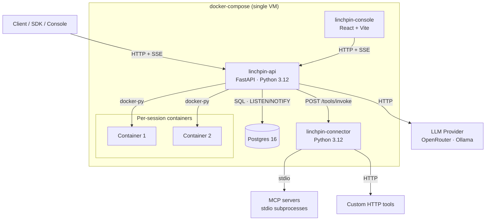
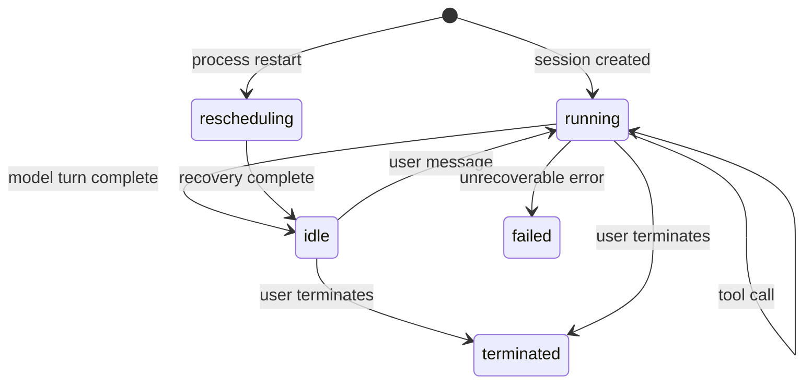

# Architecture

This document covers how Linchpin is put together: the services, how they talk, how sessions move through their lifecycle, and the event contract.

For a user-facing intro and quick start, see [README.md](README.md). For per-feature design docs, see [`.kiro/specs/`](.kiro/specs/).

## Topology

Three processes plus Postgres, all under one `docker-compose.yml`.



### Services

| Service | Stack | Purpose |
|---|---|---|
| `linchpin-api` | FastAPI · asyncpg · docker-py | HTTP surface, orchestrator loop, sandbox manager, built-in tools, SSE streaming, credential vaults |
| `linchpin-connector` | Python · httpx | MCP server lifecycle (stdio transport), custom HTTP tool invocation |
| `linchpin-console` | React · Vite · TypeScript | Web UI served via nginx |
| `postgres` | Postgres 16 | Persistent state, event log, `LISTEN/NOTIFY` fanout to orchestrators |

### Process boundaries

- **Client ↔ api**: HTTP REST + SSE, bearer auth (`LINCHPIN_API_KEY`).
- **api ↔ Postgres**: asyncpg for queries, `LISTEN/NOTIFY` to wake orchestrators when new events land.
- **api ↔ connector**: internal HTTP (`POST /tools/invoke`), no auth — connector is not exposed outside the compose network.
- **api ↔ Docker**: docker-py against the host socket (`/var/run/docker.sock` is mounted into the api container).
- **api ↔ LLM**: HTTP via provider-specific adapters. Two providers today: `openrouter` (cloud aggregator, OpenAI-compatible wire format) and `ollama` (local). Both use raw `httpx`; no upstream SDK dependency.
- **connector ↔ MCP**: one stdio subprocess per MCP server per session.
- **connector ↔ custom tools**: HTTP to user-configured endpoints.

### Sandbox network policy

The startup hook in `linchpin-api` pre-creates two Docker networks:

| `networking.type` | Network |
|---|---|
| `none` | `linchpin-none` (no egress) |
| `unrestricted` | `linchpin-open` |

Each session container is attached to one of these based on its environment config.

## Session state machine



States: `rescheduling`, `running`, `idle`, `terminated`, `failed`. Terminal states: `terminated`, `failed`.

## Orchestrator loop

One async task per live session. The loop:

1. Builds conversation context from the event log.
2. Calls the model provider.
3. Emits `agent.message` / `agent.thinking` / `agent.tool_use` events.
4. Evaluates the policy for each tool call:
   - `always_allow` → execute → emit `agent.tool_result` → loop.
   - `always_ask` → emit `session.requires_action`, block on `LISTEN/NOTIFY` until a `user.tool_confirmation` arrives.
5. On `user.interrupt`, halts the turn and transitions to `idle`.
6. On unrecoverable error, emits `session.error` and transitions to `failed`.
7. On process restart, queries non-terminal sessions, replays the event log, transitions `rescheduling` → `idle`.

Retries on the model provider: 3 attempts, exponential backoff.

## Event log

Append-only. Each event has:

- `session_id`
- `sequence` (monotonic int, internal)
- `cursor` (opaque string, used by clients for pagination + SSE replay)
- `type`
- `payload`
- `created_at`

Clients page through history with `GET /v1/sessions/{id}/events?after_cursor=...&limit=...` and pick up live updates with `GET /v1/sessions/{id}/stream?cursor=...` — the stream first replays anything newer than the cursor, then switches to live.

## Event taxonomy

**User events** (sent by clients):

- `user.message`
- `user.interrupt`
- `user.tool_confirmation`
- `user.custom_tool_result`

**Agent events** (emitted by the orchestrator):

- `agent.message`
- `agent.thinking`
- `agent.tool_use` · `agent.tool_result`
- `agent.mcp_tool_use` · `agent.mcp_tool_result`
- `agent.custom_tool_use`

**Session events**:

- `session.status_running` · `session.status_idle` · `session.status_rescheduled` · `session.status_terminated`
- `session.requires_action`
- `session.error`

## Key interfaces

```python
class SandboxProtocol(Protocol):
    async def create(self, image: str, network: str) -> str: ...   # returns container_id
    async def exec(self, container_id: str, command: str) -> ExecResult: ...
    async def write_file(self, container_id: str, path: str, content: str) -> None: ...
    async def read_file(self, container_id: str, path: str) -> str: ...
    async def destroy(self, container_id: str) -> None: ...

class ModelProviderProtocol(Protocol):
    async def send(self, messages: list[Message], config: ModelConfig) -> ModelResponse: ...

class PolicyEvaluator:
    def evaluate(self, agent: Agent, tool_name: str) -> Permission: ...
    # always_allow | always_ask | denied (tool not on agent)

class ToolInvokeRequest(BaseModel):
    session_id: str
    tool_type: Literal["mcp", "custom_http"]
    server_name: str | None       # for MCP
    tool_name: str
    arguments: dict
    credentials: dict | None      # env vars resolved from vault, for MCP
    endpoint: str | None          # for custom HTTP
```

## Credential vaults

Per-vault encrypted store (Fernet, AES-128-CBC + HMAC, keyed off `VAULT_ENCRYPTION_KEY`). Credentials are referenced by name from agent MCP server configs and decrypted on session start, then passed to the connector as a `credentials` dict on `ToolInvokeRequest`.

See [`linchpin-api/app/encryption.py`](linchpin-api/app/encryption.py) and [`.kiro/specs/credential-vaults/`](.kiro/specs/credential-vaults/).

## Repository layout

```
linchpin/
├── linchpin-api/          # FastAPI service
│   ├── app/
│   │   ├── main.py        # FastAPI app + lifespan
│   │   ├── routes/        # agents, environments, sessions, vaults
│   │   ├── orchestrator.py
│   │   ├── sandbox.py     # Docker sandbox protocol
│   │   ├── providers.py   # OpenRouter / Ollama adapters
│   │   ├── tools.py       # built-in tools
│   │   ├── policy.py      # permission evaluator
│   │   ├── streaming.py   # SSE
│   │   ├── events.py      # event log + LISTEN/NOTIFY
│   │   ├── credentials.py · encryption.py
│   │   ├── db.py · models.py · migrations.py · auth.py
│   ├── alembic/           # schema migrations
│   └── tests/
├── linchpin-connector/    # MCP + custom HTTP tool runner
│   └── app/{main.py, mcp.py, http_tools.py}
├── linchpin-console/      # React + Vite UI
├── .kiro/specs/           # design / requirements / tasks docs per feature
└── docker-compose.yml
```

## Per-feature specs

Detailed requirements / design / tasks per feature live under [`.kiro/specs/`](.kiro/specs/):

- [`linchpin-mvp`](.kiro/specs/linchpin-mvp/)
- [`linchpin-console`](.kiro/specs/linchpin-console/)
- [`credential-vaults`](.kiro/specs/credential-vaults/)
- [`mcp-tool-discovery`](.kiro/specs/mcp-tool-discovery/)
- [`sse-realtime-fix`](.kiro/specs/sse-realtime-fix/)
- [`token-streaming`](.kiro/specs/token-streaming/)
