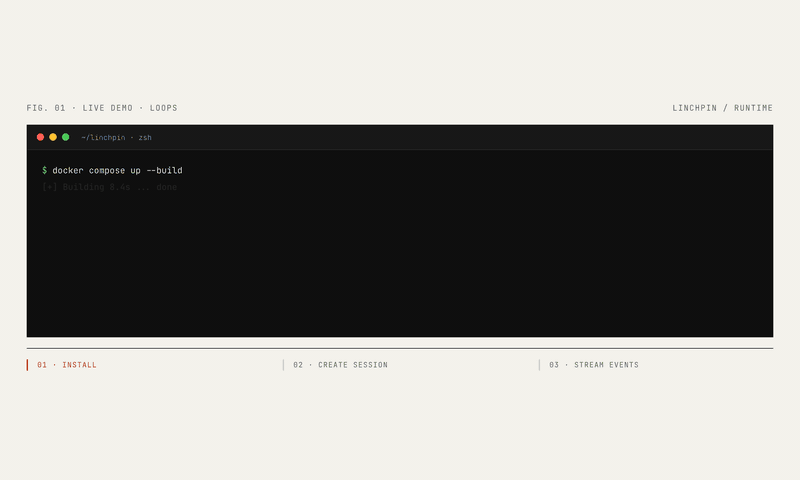

# Linchpin

> Open-source, self-hostable runtime for managed AI agents. Apache-2.0.

<p align="center">
  <a href="https://linchpin.work"></a>
</p>

<p align="center">
  <a href="https://linchpin.work">Website</a>
  ·
  <a href="https://linchpin.work/architecture">Architecture</a>
  ·
  <a href="ARCHITECTURE.md">Internals</a>
  ·
  <a href="CONTRIBUTING.md">Contributing</a>
</p>

Linchpin is an open standard and self-hostable runtime for **managed AI agents**. Run a managed-agent system on your own infrastructure with the widest possible model coverage — every cloud model via [OpenRouter](https://openrouter.ai) (Claude, GPT, Gemini, Llama, DeepSeek, Mistral, Qwen, …) plus local models via [Ollama](https://ollama.com) — without vendor lock-in.

You define **agents** (model + system prompt + tools + permissions) and **environments** (container templates). You start a **session** and Linchpin spins up an isolated Docker container, drives the agent loop, and streams every message, tool call, and status change back to you over SSE.

## Quick start

Requires Docker + Docker Compose.

```bash
git clone https://github.com/flowagent-sh/linchpin.git
cd linchpin
cp .env.example .env   # set LINCHPIN_API_KEY + your model provider key
docker compose up --build
```

| URL | What |
|---|---|
| `http://localhost:8000` | API |
| `http://localhost:3000` | Web console |
| `http://localhost:8001` | Connector (internal) |

### Environment variables

| Variable | Required | Notes |
|---|---|---|
| `LINCHPIN_API_KEY` | yes | Bearer token for the API |
| `VAULT_ENCRYPTION_KEY` | yes | Fernet key (32 url-safe base64 bytes) for credential encryption |
| `OPENROUTER_API_KEY` | for cloud models | Get one at https://openrouter.ai/keys |
| `CORS_ALLOWED_ORIGINS` | no | Defaults to `http://localhost:3000` |

For Ollama, point an agent's `model.base_url` at your Ollama instance — no env var needed.

## Hello world

All requests need `Authorization: Bearer $LINCHPIN_API_KEY`.

```bash
# 1. Create an environment
curl -sX POST http://localhost:8000/v1/environments \
  -H "Authorization: Bearer $LINCHPIN_API_KEY" -H "Content-Type: application/json" \
  -d '{"name":"default","config":{"networking":{"type":"unrestricted"}}}'

# 2. Create an agent
curl -sX POST http://localhost:8000/v1/agents \
  -H "Authorization: Bearer $LINCHPIN_API_KEY" -H "Content-Type: application/json" \
  -d '{
    "name": "coder",
    "model": {"provider": "openrouter", "id": "anthropic/claude-sonnet-4"},
    "system": "You are a careful Python engineer.",
    "tools": [
      {"name": "bash",  "permission": "always_ask"},
      {"name": "read",  "permission": "always_allow"},
      {"name": "write", "permission": "always_ask"},
      {"name": "edit",  "permission": "always_ask"},
      {"name": "glob",  "permission": "always_allow"},
      {"name": "grep",  "permission": "always_allow"}
    ]
  }'

# 3. Start a session
curl -sX POST http://localhost:8000/v1/sessions \
  -H "Authorization: Bearer $LINCHPIN_API_KEY" -H "Content-Type: application/json" \
  -d '{"agent_id":"<id>","environment_id":"<id>"}'

# 4. Send a message
curl -sX POST http://localhost:8000/v1/sessions/<id>/events \
  -H "Authorization: Bearer $LINCHPIN_API_KEY" -H "Content-Type: application/json" \
  -d '{"type":"user.message","payload":{"text":"List the files in /workspace"}}'

# 5. Stream the response
curl -N http://localhost:8000/v1/sessions/<id>/stream \
  -H "Authorization: Bearer $LINCHPIN_API_KEY"
```

When the agent calls a tool with `always_ask`, the stream emits `session.requires_action`. Approve with:

```bash
curl -sX POST http://localhost:8000/v1/sessions/<id>/events \
  -H "Authorization: Bearer $LINCHPIN_API_KEY" -H "Content-Type: application/json" \
  -d '{"type":"user.tool_confirmation","payload":{"tool_use_id":"...","approved":true}}'
```

Or use the web console at `http://localhost:3000`.

## What you can do

### Agents

Versioned configs: model, system prompt, tools, MCP servers, per-tool permissions. Editing an agent bumps its version; existing sessions keep running against the version they were created with.

### Models

| Provider | Where it runs | What you get |
|---|---|---|
| `openrouter` | Cloud (via OpenRouter) | ~200 models — Claude, GPT, Gemini, Llama, DeepSeek, Mistral, Qwen, … |
| `ollama` | Your machine | Whatever you've `ollama pull`'d locally |

OpenRouter model ids use the upstream-provider prefix (`anthropic/claude-sonnet-4`, `openai/gpt-4o`, `google/gemini-2.5-pro`, `meta-llama/llama-3.1-405b`, …). For Ollama, pass the local model tag (`llama3`, `qwen2.5-coder`, …) and set `base_url` to your Ollama endpoint.

### Built-in tools

`bash` · `read` · `write` · `edit` · `glob` · `grep` · `web_fetch` · `web_search`

All execute inside the session's container.

### Custom tools

Two ways to extend an agent's toolbox:

- **MCP servers** — configure `command` / `args` / `env`; the connector runs each as a stdio subprocess.
- **HTTP tools** — configure an `endpoint`; the connector POSTs the tool call and returns the response.

### Permissions

Each tool entry on an agent is either `always_allow` (execute immediately) or `always_ask` (block on `user.tool_confirmation`).

### Sandboxing

Each session runs in its own container (Ubuntu 22.04 · Python 3.12 · Node 20 · git · curl · jq · ripgrep). Networking is per-environment:

| `networking.type` | Behavior |
|---|---|
| `none` | No outbound network |
| `unrestricted` | Full outbound network |

### Credential vaults

Encrypted credential storage. Reference credentials by name from agent MCP server configs; they're decrypted and injected as env vars when the session starts.

### Web console

A React UI for browsing agents/environments/sessions and chatting with agents live.

## API reference

All endpoints are under `/v1` and require bearer auth.

| Method | Path | Purpose |
|---|---|---|
| `POST` `GET` | `/v1/agents` | Create / list agents |
| `GET` | `/v1/agents/{id}` | Fetch agent |
| `POST` `GET` | `/v1/environments` | Create / list environments |
| `GET` | `/v1/environments/{id}` | Fetch environment |
| `POST` `GET` | `/v1/sessions` | Create / list sessions |
| `GET` `DELETE` | `/v1/sessions/{id}` | Fetch / terminate session |
| `POST` | `/v1/sessions/{id}/archive` | Archive session |
| `POST` `GET` | `/v1/sessions/{id}/events` | Send event / list events (cursor-paginated) |
| `GET` | `/v1/sessions/{id}/stream` | SSE stream (supports `?cursor=` replay) |
| `POST` `GET` | `/v1/vaults` | Create / list vaults |
| `POST` `GET` | `/v1/vaults/{id}/credentials` | Manage credentials |

## Development

```bash
cd linchpin-api
uv venv && source .venv/bin/activate
uv pip install -e ".[dev]"
alembic upgrade head
uvicorn app.main:app --reload
pytest

cd ../linchpin-connector
uv pip install -e ".[dev]"
pytest

cd ../linchpin-console
pnpm install && pnpm dev
```

## How it works

For the session state machine, orchestrator loop, event taxonomy, component breakdown, and repo layout, see [ARCHITECTURE.md](ARCHITECTURE.md).

Per-feature specs (requirements · design · tasks) live under [`.kiro/specs/`](.kiro/specs/).

## License

[Apache-2.0](LICENSE). Copyright © 2026 Flow Agent Inc. and Linchpin contributors.

See [CONTRIBUTING.md](CONTRIBUTING.md) for the developer certificate of origin (DCO) sign-off requirement.
